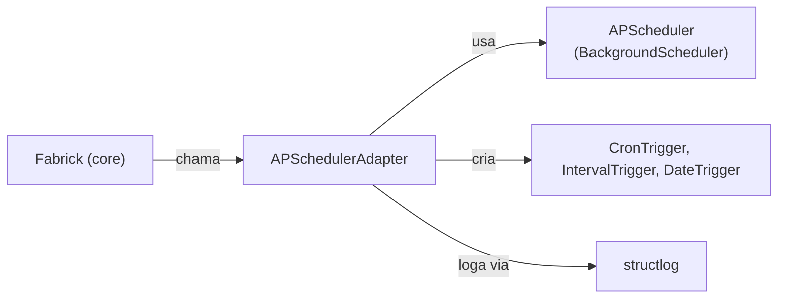
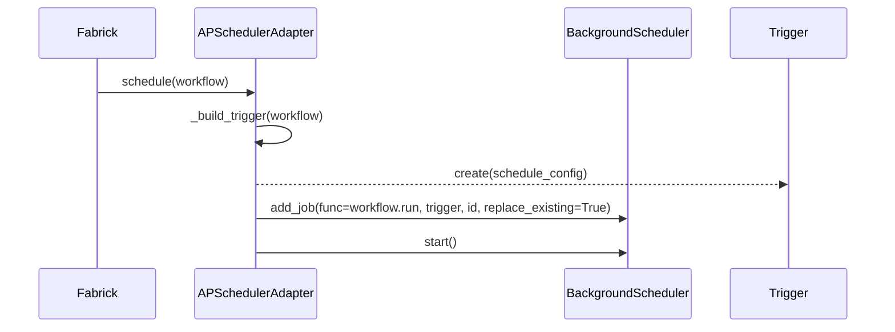

# modulo_apscheduling — Especificação Técnica (Adapter de Scheduler)

## 1) Visão geral

O módulo `apscheduling` implementa um adapter de agendamento para o Fabrick, utilizando a biblioteca `APScheduler`. Sua responsabilidade é traduzir a configuração de agendamento de um workflow (`Fabrick.scheduler`) em um `trigger` compatível com o `APScheduler` e registrar o método `workflow.run` para execução.

**Arquivos e referências:**
- Implementação: [apscheduling.py](file:///c:/Users/User/OneDrive%20-%20Boreal/Documentos/newcode/faktory-builder/fabrick/fabrikk/adapters/scheduler/apscheduling.py)
- Interface base: [base.py](file:///c:/Users/User/OneDrive%20-%20Boreal/Documentos/newcode/faktory-builder/fabrick/fabrikk/adapters/scheduler/base.py)
- Core do Fabrick: [core.py](file:///c:/Users/User/OneDrive%20-%20Boreal/Documentos/newcode/faktory-builder/fabrick/fabrikk/core.py)

## 2) Responsabilidades

- Implementar a interface `SchedulerAdapter`.
- Inicializar um `BackgroundScheduler` para executar jobs em segundo plano.
- Agendar a execução de um workflow (`Fabrick.run`) com base na configuração fornecida.
- Construir o `trigger` apropriado (`CronTrigger`, `IntervalTrigger`, `DateTrigger`) a partir da configuração do workflow.
- Garantir que jobs com o mesmo nome sejam substituídos (`replace_existing=True`).
- Produzir logs estruturados sobre a inicialização, agendamento e início do scheduler.

## 3) Dependências

**Dependências internas:**
- `fabrikk.adapters.scheduler.base.SchedulerAdapter`: Interface que a classe `APSchedulerAdapter` implementa.
- `fabrikk.logging_config.get_logger`: Para logging estruturado.

**Dependências externas (runtime):**
- `apscheduler`: Biblioteca principal para agendamento de tarefas.
  - `BackgroundScheduler`: Para executar jobs em uma thread de background.
  - `CronTrigger`, `IntervalTrigger`, `DateTrigger`: Para definir quando os jobs devem ser executados.

## 4) Interfaces (Entradas/Saídas)

### 4.1 API pública (classe APSchedulerAdapter)

**Construtor**
- `APSchedulerAdapter()`
  - Inicializa `self.scheduler = BackgroundScheduler()`.

**Métodos**
- `schedule(self, workflow) -> None`
  - Entrada: `workflow` (uma instância de `Fabrick`) que contém a configuração `workflow.scheduler`.
  - Saída: Agenda `workflow.run` para execução e inicia o scheduler.
  - Erros:
    - `ValueError` se a configuração `workflow.scheduler` for inválida.

### 4.2 Contrato de configuração do scheduler (workflow.scheduler)

O adapter espera que `workflow.scheduler` seja um dos seguintes:

- `str`: Uma expressão crontab (ex: `"*/5 * * * *"`).
- `dict`: Um dicionário especificando o tipo de trigger e seus parâmetros.
  - `{"type": "interval", "value": {"minutes": 5}}`
  - `{"type": "date", "value": {"run_date": "2024-12-25 12:00:00"}}`

## 5) Arquitetura interna

### 5.1 Estruturas internas

- `self.scheduler: BackgroundScheduler`

### 5.2 Construção do Trigger

O método privado `_build_trigger(self, workflow)` é responsável por interpretar `workflow.scheduler`:

- Se for uma `string`, cria um `CronTrigger` usando `CronTrigger.from_crontab()`.
- Se for um `dict`, verifica o campo `type`:
  - `"interval"`: Cria um `IntervalTrigger` passando `schedule["value"]` como argumentos.
  - `"date"`: Cria um `DateTrigger` passando `schedule["value"]` como argumentos.
- Se o formato for desconhecido, lança um `ValueError`.

## 6) Fluxos de dados e execução

### 6.1 Fluxo de agendamento

1. O `Fabrick.start()` chama `APSchedulerAdapter.schedule(workflow)`.
2. `schedule()` chama `_build_trigger()` para obter o trigger correto.
3. `schedule()` chama `self.scheduler.add_job()` com:
   - `func=workflow.run`
   - `trigger`
   - `id=workflow.name`
   - `replace_existing=True`
4. `schedule()` chama `self.scheduler.start()` para iniciar o processo de agendamento em background.

## 7) Diagramas

### 7.1 Diagrama de componentes

### 7.2 Diagrama de sequência: agendamento

## 8) APIs expostas (contratos e convenções)

- A classe `APSchedulerAdapter` segue o contrato definido por `SchedulerAdapter`.
- A convenção para o ID do job no `APScheduler` é o nome do workflow (`workflow.name`).

## 9) Algoritmos principais

### 9.1 Resolução de Trigger

- A lógica principal está em `_build_trigger`, que é um dispatcher baseado no tipo de `workflow.scheduler` (string ou dict com `type`).

## 10) Casos de uso suportados

- Agendamento de workflows baseado em expressões cron.
- Agendamento de workflows para execução em intervalos regulares.
- Agendamento de workflows para execução em uma data e hora específicas.

## 11) Requisitos de performance

- O `BackgroundScheduler` roda em uma thread separada, portanto, o impacto na thread principal da aplicação é mínimo durante a execução do job.
- A criação de triggers e o agendamento de jobs são operações de baixo custo.

## 12) Testes unitários necessários

- `schedule()` deve chamar `_build_trigger` e `add_job` com os parâmetros corretos.
- `_build_trigger()` deve retornar `CronTrigger` para uma string crontab.
- `_build_trigger()` deve retornar `IntervalTrigger` para um dict com `type="interval"`.
- `_build_trigger()` deve retornar `DateTrigger` para um dict com `type="date"`.
- `_build_trigger()` deve lançar `ValueError` para uma configuração de scheduler inválida.
- `schedule()` deve chamar `scheduler.start()`.

## 13) Pontos de extensão e refatoração

- **Gerenciamento do ciclo de vida do scheduler:** O scheduler é iniciado a cada chamada de `schedule()`. Para aplicações que agendam múltiplos workflows, o `BackgroundScheduler` poderia ser gerenciado como um singleton para evitar a criação de múltiplas threads de scheduler.
- **Configuração do Scheduler:** A inicialização do `BackgroundScheduler` é feita sem parâmetros. Poderia ser estendido para aceitar configurações (ex: `jobstores`, `executors`) a partir de um arquivo de configuração global.
- **Novos Tipos de Trigger:** O adapter poderia ser estendido para suportar outros tipos de triggers do `APScheduler` se necessário.
