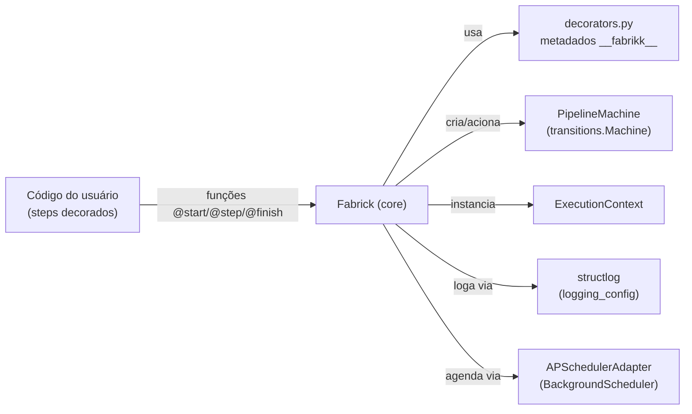
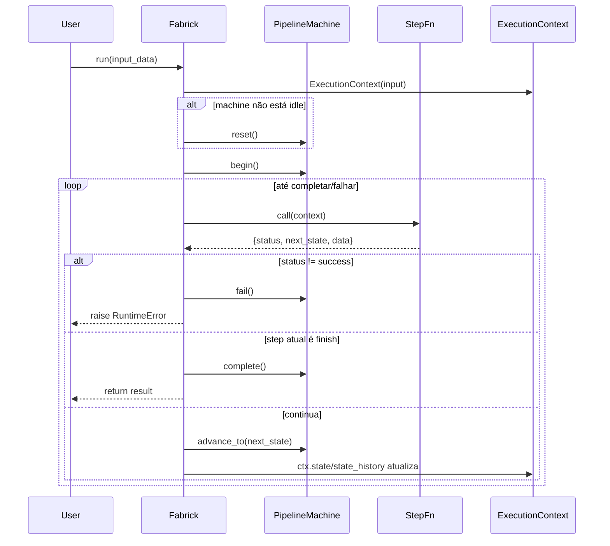

# modulo_core — Especificação Técnica (Fabrick Runtime)

## 1) Visão geral

O módulo `core` implementa o runtime principal do Fabrick: registro de steps, construção de máquina de estados, execução do pipeline e integração com agendamento. O artefato central é a classe `Fabrick`, que recebe steps decorados (`@start`, `@step`, `@finish`) e executa uma sequência guiada por `next_state`.

**Arquivos e referências:**
- Implementação: [core.py](file:///c:/Users/User/OneDrive%20-%20Boreal/Documentos/newcode/faktory-builder/fabrick/fabrikk/core.py)
- Decorators: [decorators.py](file:///c:/Users/User/OneDrive%20-%20Boreal/Documentos/newcode/faktory-builder/fabrick/fabrikk/decorators.py)
- Máquina de estados: [machine.py](file:///c:/Users/User/OneDrive%20-%20Boreal/Documentos/newcode/faktory-builder/fabrick/fabrikk/machine.py)
- Contexto de execução: [context.py](file:///c:/Users/User/OneDrive%20-%20Boreal/Documentos/newcode/faktory-builder/fabrick/fabrikk/context.py)
- Scheduler adapter: [apscheduling.py](file:///c:/Users/User/OneDrive%20-%20Boreal/Documentos/newcode/faktory-builder/fabrick/fabrikk/adapters/scheduler/apscheduling.py)
- Logging: [logging_config.py](file:///c:/Users/User/OneDrive%20-%20Boreal/Documentos/newcode/faktory-builder/fabrick/fabrikk/logging_config.py)

## 2) Responsabilidades

- Manter a configuração do pipeline (nome, scheduler, retry, execution_mode, etc.).
- Registrar steps decorados e validar a presença de `@start` e `@finish`.
- Construir e operar uma máquina de estados coerente com os steps registrados.
- Executar o pipeline step-a-step, propagando um `ExecutionContext`.
- Integrar com o adapter de scheduler (APScheduler) quando `scheduler` estiver definido.
- Produzir logs estruturados durante inicialização, execução e falhas.

## 3) Dependências

**Dependências internas:**
- `fabrikk.context.ExecutionContext` para carregar `input`, `metadata` e rastrear estado.
- `fabrikk.machine.PipelineMachine` para controlar transições e ciclo de vida.
- `fabrikk.adapters.scheduler.apscheduling.APSchedulerAdapter` para agendamento.
- `fabrikk.logging_config.get_logger` para logs.

**Dependências externas (runtime):**
- `transitions` (via `PipelineMachine`) para state machine.
- `apscheduler` (via `APSchedulerAdapter`) para scheduling.
- `structlog` (via `logging_config`) para logging estruturado.

## 4) Interfaces (Entradas/Saídas)

### 4.1 API pública (classe Fabrick)

**Construtor**
- `Fabrick(name: str, scheduler=None, start_at=None, retry=False, execution_mode="local", persistence=None, observability=None)`

**Métodos**
- `register(*functions) -> None`
  - Entrada: funções Python decoradas com `@start`, `@step` ou `@finish` (metadados em `fn.__fabrikk__`).
  - Saída: armazena steps em `self.steps`, define `self.start_step`, `self.finish_step` e constrói `self.machine`.
  - Erros:
    - `ValueError` se uma função não estiver decorada.
    - `RuntimeError` se faltar `@start` ou `@finish`.

- `start() -> None`
  - Entrada: usa `self.scheduler` para decidir entre execução imediata ou agendada.
  - Saída: chama `run()` imediatamente ou delega para `APSchedulerAdapter.schedule(self)`.

- `run(input_data=None) -> dict`
  - Entrada: `input_data` opcional; repassado para `ExecutionContext(input=...)`.
  - Saída: retorna o dict de resultado do último step (`@finish`).
  - Erros:
    - `RuntimeError` para contratos quebrados (ex.: status != success, next_state ausente).
    - `InvalidTransitionError` quando transição é inválida em modo estrito.
    - Propaga exceções lançadas pelo step (após marcar falha na state machine).

### 4.2 Contrato de step (interface de I/O)

Cada step é uma função `fn(context: ExecutionContext) -> dict`, com retorno esperado:

- `status`: `"success"` para continuar; qualquer outro valor causa falha.
- `data`: payload do step (opcional; não consumido pelo core no estado atual).
- `next_state`: obrigatório para steps não-finalizadores; deve existir em `self.steps`.
- `metadata`: opcional.

Observação: o `ExecutionContext` atual guarda `input`, `state`, `metadata` e `state_history` (não possui `data` agregado no runtime atual). Isso cria um descompasso com exemplos que referenciam `context.data`.

## 5) Arquitetura interna

### 5.1 Estruturas internas

- `self.steps: dict[str, callable]` mapeia nome do step → função.
- `self.start_step: callable | None`
- `self.finish_step: callable | None`
- `self.machine: PipelineMachine | None`

### 5.2 Construção da máquina de estados

Em `register()`, após validar presença de `@start` e `@finish`, o core chama `_build_machine()`:

- Extrai `steps_meta` com `{name, kind, transitions_to}` de `fn.__fabrikk__`.
- Cria `PipelineMachine(steps_meta, start_name, finish_name)`.
- O modo é definido pelo `PipelineMachine`:
  - Flexível: qualquer step pode ir para qualquer step.
  - Estrito: apenas transições explicitamente declaradas via `@step(transitions_to=[...])`.

## 6) Fluxos de dados e execução

### 6.1 Fluxo de execução principal

1. Inicializa `ExecutionContext(input=input_data)`.
2. Reseta a state machine para `idle` se já tiver rodado antes.
3. Transiciona `idle -> start_step` via `machine.begin()`.
4. Executa loop:
   - Executa step atual.
   - Valida retorno (`status`, `next_state`).
   - Se for `finish_step`, chama `machine.complete()` e retorna resultado.
   - Senão, valida existência de `next_state` e faz `machine.advance_to(next_state)`.
   - Atualiza `ctx.state` e `ctx.state_history`.
   - Define step atual para `self.steps[next_state]`.

### 6.2 Fluxo de agendamento

Quando `scheduler` é informado, `start()` chama `APSchedulerAdapter.schedule(self)`, que:

- Converte `workflow.scheduler` em um Trigger:
  - string → `CronTrigger.from_crontab(...)`
  - dict com `type=interval|date` → `IntervalTrigger(**value)` ou `DateTrigger(**value)`
- Adiciona job com `func=workflow.run`, `id=workflow.name`, `replace_existing=True`.
- Inicia um `BackgroundScheduler`.

## 7) Diagramas

### 7.1 Diagrama de componentes



### 7.2 Diagrama de sequência: execução `run()`



## 8) APIs expostas (contratos e convenções)

- API de construção: `Fabrick(...).register(...).start()` ou `run()`.
- API de step: `fn(context) -> dict` com campos `status`, `next_state`, `data`, `metadata`.
- Convenção de nomes:
  - nome do estado = `fn.__name__` por padrão.
  - nomes reservados no runtime da state machine: `idle`, `completed`, `failed` (validados em `PipelineMachine`).

## 9) Algoritmos principais

### 9.1 Resolução de step e transição

- Lookup do próximo step: `O(1)` em `self.steps[next_state]`.
- Validação do fluxo:
  - `next_state` obrigatório (exceto no finish).
  - `next_state` deve existir no mapa de steps.
  - `PipelineMachine.advance_to()` valida triggers permitidos:
    - Em modo estrito, exige declaração explícita de transição.
    - Em modo flexível, existem triggers para todos os pares `source != dest`.

### 9.2 Tratamento de erros

- Exceção no step: registra, marca `fail()` na máquina, re-raise.
- Retorno inválido: marca falha e lança `RuntimeError`.
- Transição inválida: `InvalidTransitionError` (subclasse de `RuntimeError`) e marca falha.

## 10) Casos de uso suportados

- Orquestração simples de steps síncronos em processo único.
- Pipelines com decisão dinâmica via `next_state`.
- Validação de transições quando configurado em modo estrito (`transitions_to`).
- Execução imediata (`start()` sem `scheduler`) ou agendada (`scheduler` com cron/interval/date).

## 11) Requisitos de performance

- Execução: custo linear em número de steps executados (`O(n)`), com overhead constante de logging e validações.
- Logging: volume proporcional a passos e transições; em pipelines longos, considerar reduzir log level para `INFO`/`WARNING` conforme ambiente.
- Agendamento: `BackgroundScheduler` cria thread(s) em background; para workloads intensas, isolar execução do job ou limitar concorrência no scheduler (não implementado no adapter atual).

## 12) Testes unitários necessários

### 12.1 Registro e validação

- `register()` deve falhar se alguma função não tiver `__fabrikk__`.
- `register()` deve falhar se não houver `@start`.
- `register()` deve falhar se não houver `@finish`.
- `register()` deve construir `PipelineMachine` e expor `machine.is_strict` coerente com `transitions_to`.

### 12.2 Execução `run()`

- Caminho feliz: start → steps → finish retorna resultado do finish.
- Falha por `status != success` marca falha e lança `RuntimeError`.
- Falha por `next_state` ausente em step não-finalizador.
- Falha por `next_state` inexistente no mapa de steps.
- Modo estrito: deve lançar `InvalidTransitionError` quando step tenta transição não declarada.
- Re-execução: após uma execução que saiu de `idle`, `run()` deve resetar a máquina corretamente.

### 12.3 Scheduler `start()`

- Sem `scheduler`: `start()` deve chamar `run()` (pode ser testado com spy/mocks).
- Com `scheduler` string: `_build_trigger()` deve gerar CronTrigger a partir de crontab (CronTrigger.from_crontab é a API recomendada em APScheduler) [1].
- Com `scheduler` dict interval/date: deve gerar trigger correspondente.
- `APSchedulerAdapter.schedule()` deve chamar `add_job(..., replace_existing=True)` e iniciar scheduler.

## 13) Pontos de extensão e refatoração

- **Contrato de dados no contexto:** `ExecutionContext` não agrega `data` no estado atual; padronizar isso (ex.: `ctx.data` acumulado) para alinhar com exemplos.
- **Pydantic para contratos de step:** substituir dicts por modelos (ex.: `StepResult`) com validação.
- **Retry:** flag `retry` existe, mas a execução aborta com "ainda não implementado".
- **Persistência/observabilidade:** parâmetros existem, mas não há implementação no core.
- **Adapters:** `SchedulerAdapter` define interface mínima (`schedule(workflow)`); permite adicionar novos backends (cloud, filas).
- **Concorrência e lifecycle do scheduler:** `BackgroundScheduler` é iniciado a cada `schedule()`; considerar singleton/gerenciamento de lifecycle para apps long-lived.

## Referências externas

- Mermaid em Markdown (blocos ` ```mermaid `) é suportado em renderizadores como o GitHub, facilitando diagramas versionáveis [2].
- Mermaid Sequence Diagram: sintaxe e recursos como `loop`, `alt`, `opt` e notas [3].
- APScheduler: conceitos de scheduler/triggers e job scheduling; `CronTrigger.from_crontab` para expressões padrão [1].
- structlog: configuração via `structlog.configure()` e uso de processors; `contextvars.merge_contextvars` para contexto por execução [4].

[1]: https://apscheduler.readthedocs.io/en/stable/modules/triggers/cron.html
[2]: https://github.blog/developer-skills/github/include-diagrams-markdown-files-mermaid/
[3]: https://mermaid.js.org/syntax/sequenceDiagram.html
[4]: https://www.structlog.org/en/stable/contextvars.html

