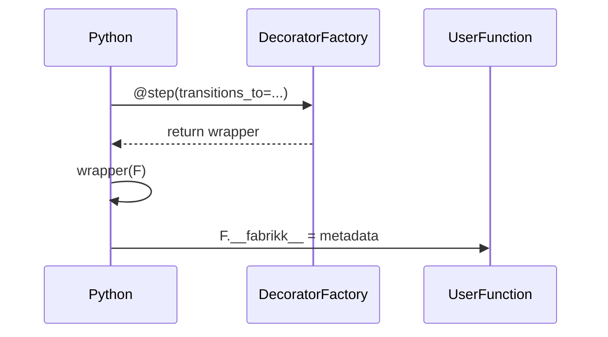

# modulo_decorators — Especificação Técnica (Decorators de Step)

## 1) Visão geral

O módulo `decorators` fornece os decorators (`@start`, `@step`, `@finish`) que são usados para anotar funções Python e marcá-las como steps de um pipeline Fabrick. Esses decorators anexam metadados à função decorada através de um atributo especial `__fabrikk__`, que é posteriormente consumido pelo `Fabrick.register()` para construir a máquina de estados.

**Arquivos e referências:**
- Implementação: [decorators.py](file:///c:/Users/User/OneDrive%20-%20Boreal/Documentos/newcode/faktory-builder/fabrick/fabrikk/decorators.py)
- Core do Fabrick: [core.py](file:///c:/Users/User/OneDrive%20-%20Boreal/Documentos/newcode/faktory-builder/fabrick/fabrikk/core.py)

## 2) Responsabilidades

- Fornecer os decorators `@start`, `@step`, e `@finish`.
- Anexar um dicionário de metadados `__fabrikk__` à função decorada.
- Diferenciar entre o uso de um decorator "nu" (ex: `@step`) e um decorator parametrizado (ex: `@step(transitions_to=["outro_step"])`).
- Armazenar o tipo (`kind`) do step ("start", "step", "finish"), o nome da função e as transições permitidas (`transitions_to`).

## 3) Dependências

**Dependências internas:**
- Nenhuma.

**Dependências externas (runtime):**
- Nenhuma.

## 4) Interfaces (Entradas/Saídas)

### 4.1 API pública (decorators)

- `@start`: Marca a função como o ponto de entrada do pipeline.
- `@step`: Marca a função como um passo intermediário do pipeline.
- `@finish`: Marca a função como o ponto de finalização do pipeline.

O decorator `@step` pode opcionalmente receber o argumento `transitions_to`:

- `@step(transitions_to: list[str] | None = None)`:
  - `transitions_to`: Uma lista de nomes de steps para os quais este step pode transicionar. Usado para construir uma máquina de estados em modo "estrito".

### 4.2 Contrato de metadados (`__fabrikk__`)

Cada função decorada terá um atributo `__fabrikk__` contendo um dicionário com as seguintes chaves:

- `kind`: `str` - "start", "step", ou "finish".
- `name`: `str` - O nome da função (`fn.__name__`).
- `transitions_to`: `list[str] | None` - A lista de transições permitidas, ou `None` se não for especificado.

## 5) Arquitetura interna

A funcionalidade é implementada através de uma factory de decorators chamada `_register(kind)`.

- `_register(kind)`: É uma função de ordem superior que recebe o `kind` ("start", "step", "finish") e retorna um decorator.
- O decorator retornado pode lidar com duas formas de chamada:
  1. **Decorator "nu" (`@step`):** Quando `fn` não é `None`, ele anexa diretamente os metadados à função.
  2. **Decorator parametrizado (`@step(...)`):** Quando `fn` é `None`, ele retorna uma função `wrapper` que captura os argumentos (como `transitions_to`) e então decora a função, anexando os metadados.

As instâncias dos decorators são criadas no final do arquivo:
```python
start = _register("start")
step = _register("step")
finish = _register("finish")
```

## 6) Fluxos de dados e execução

1. O usuário decora uma função em seu código, por exemplo: `@step(transitions_to=["proximo"])`.
2. O Python executa `step(transitions_to=["proximo"])`, que retorna a função `wrapper`.
3. O `wrapper` é então aplicado à função do usuário, anexando o atributo `__fabrikk__` com `{"kind": "step", "name": "...", "transitions_to": ["proximo"]}`.
4. Mais tarde, quando `Fabrick.register()` recebe esta função, ele lê `fn.__fabrikk__` para entender o papel e as conexões do step no pipeline.

## 7) Diagramas

### 7.1 Diagrama de sequência: aplicação do decorator



## 8) APIs expostas (contratos e convenções)

- A principal convenção é o uso do atributo "dunder" `__fabrikk__` para armazenar metadados de forma não obstrutiva.

## 9) Algoritmos principais

- A lógica principal é a detecção de decorator "nu" vs. parametrizado, que é um padrão comum para criar decorators flexíveis em Python.

## 10) Casos de uso suportados

- Definição de steps de início, meio e fim de um pipeline.
- Definição de pipelines em modo "flexível" (sem `transitions_to`).
- Definição de pipelines em modo "estrito" (com `transitions_to` para validar transições).

## 11) Requisitos de performance

- O custo de aplicar os decorators ocorre no momento do carregamento do módulo (import time) e é insignificante. Não há impacto na performance do runtime da execução do pipeline.

## 12) Testes unitários necessários

- Uma função decorada com `@start` deve ter `__fabrikk__["kind"] == "start"`.
- Uma função decorada com `@step` deve ter `__fabrikk__["kind"] == "step"`.
- Uma função decorada com `@finish` deve ter `__fabrikk__["kind"] == "finish"`.
- Uma função decorada com `@step` (sem parâmetros) deve ter `__fabrikk__["transitions_to"]` como `None`.
- Uma função decorada com `@step(transitions_to=["a", "b"])` deve ter `__fabrikk__["transitions_to"] == ["a", "b"]`.
- O nome do step em `__fabrikk__["name"]` deve corresponder ao `__name__` da função.

## 13) Pontos de extensão e refatoração

- **Mais metadados:** O decorator poderia ser estendido para capturar mais metadados sobre o step, como `retries`, `timeout`, ou um `description` para documentação automática.
- **Validação de `transitions_to`:** O tipo de `transitions_to` poderia ser validado no momento da decoração (ex: garantir que é uma lista de strings).
