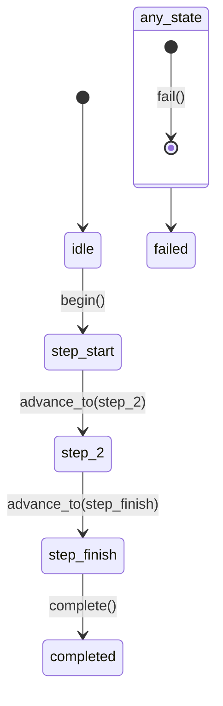

# modulo_machine — Especificação Técnica (Máquina de Estados do Pipeline)

## 1) Visão geral

O módulo `machine` implementa a classe `PipelineMachine`, um wrapper em torno da biblioteca `transitions` que gerencia o ciclo de vida e as transições de estado de um pipeline Fabrick. Ele é responsável por construir uma máquina de estados com base nos steps registrados, operar em modo "flexível" ou "estrito" e garantir que apenas transições válidas ocorram.

**Arquivos e referências:**
- Implementação: [machine.py](file:///c:/Users/User/OneDrive%20-%20Boreal/Documentos/newcode/faktory-builder/fabrick/fabrikk/machine.py)
- Core do Fabrick: [core.py](file:///c:/Users/User/OneDrive%20-%20Boreal/Documentos/newcode/faktory-builder/fabrick/fabrikk/core.py)
- Decorators: [decorators.py](file:///c:/Users/User/OneDrive%20-%20Boreal/Documentos/newcode/faktory-builder/fabrick/fabrikk/decorators.py)

## 2) Responsabilidades

- Construir uma máquina de estados a partir dos metadados dos steps (`steps_meta`).
- Definir e gerenciar os estados do pipeline: `idle`, nomes dos steps, `completed`, `failed`.
- Operar em dois modos:
  - **Flexível:** Qualquer step pode transicionar para qualquer outro (padrão).
  - **Estrito:** Apenas transições explicitamente declaradas via `@step(transitions_to=[...])` são permitidas.
- Validar que os nomes dos steps não conflitem com nomes de estado reservados (`idle`, `completed`, `failed`).
- Fornecer uma API para iniciar (`begin`), avançar (`advance_to`), falhar (`fail`) e completar (`complete`) o pipeline.
- Registrar logs antes e depois de cada mudança de estado.
- Lançar uma exceção customizada (`InvalidTransitionError`) ao tentar uma transição inválida.

## 3) Dependências

**Dependências internas:**
- `fabrikk.logging_config.get_logger`: Para logging estruturado.

**Dependências externas (runtime):**
- `transitions`: Biblioteca principal para a criação e gerenciamento da máquina de estados.

## 4) Interfaces (Entradas/Saídas)

### 4.1 API pública (classe PipelineMachine)

**Construtor**
- `PipelineMachine(steps_meta, start_step_name, finish_step_name)`
  - `steps_meta`: Lista de dicionários de metadados de cada step.
  - `start_step_name`: O nome do step `@start`.
  - `finish_step_name`: O nome do step `@finish`.
  - Erros: `ValueError` se um nome de step for reservado.

**Métodos**
- `advance_to(self, target_state) -> None`: Tenta transicionar para o `target_state`.
  - Erros: `InvalidTransitionError` se a transição não for permitida.
- `reset(self) -> None`: Reseta a máquina para o estado `idle`.
- `get_allowed_triggers(self) -> list[str]`: Retorna uma lista de triggers permitidos a partir do estado atual.

**Propriedades**
- `current_state`: Retorna o estado atual da máquina.
- `is_strict`: Retorna `True` se a máquina estiver operando em modo estrito.

**Métodos de trigger (herdados de `transitions.Machine`)**
- `begin()`: Transiciona de `idle` para o `start_step`.
- `fail()`: Transiciona de qualquer estado para `failed`.
- `complete()`: Transiciona do `finish_step` para `completed`.

## 5) Arquitetura interna

### 5.1 Estruturas internas

- `self._machine: transitions.Machine`: A instância da máquina de estados subjacente.
- `self._strict: bool`: Flag que indica o modo de operação.
- `self.state`: O atributo que armazena o estado atual, gerenciado pela biblioteca `transitions`.

### 5.2 Construção da Máquina de Estados

O construtor executa os seguintes passos:
1.  Valida se algum nome de step está na lista de `RESERVED_STATES`.
2.  Determina o modo de operação (`_strict`) verificando se algum step possui o metadado `transitions_to`.
3.  Define a lista de todos os estados: `idle`, os nomes dos steps, `completed` e `failed`.
4.  Chama `_build_transitions()` para gerar a lista de transições permitidas.
5.  Instancia `transitions.Machine` com os estados, transições e callbacks de log.

### 5.3 Geração de Transições (`_build_transitions`)

- **Transições fixas:**
  - `begin`: `idle` -> `start_step`.
  - `fail`: `*` (qualquer estado) -> `failed`.
  - `complete`: `finish_step` -> `completed`.
- **Transições dinâmicas:**
  - **Modo Estrito:** Para cada step com `transitions_to`, cria um trigger `to_<target>` do step de origem para cada destino declarado.
  - **Modo Flexível:** Cria triggers `to_<dest>` para todas as combinações possíveis de `source != dest` entre os steps.

## 6) Fluxos de dados e execução

1.  O `Fabrick.register()` cria uma instância de `PipelineMachine`.
2.  O `Fabrick.run()` chama `machine.begin()` para iniciar a execução.
3.  Após cada step, o `Fabrick.run()` chama `machine.advance_to(next_state)`.
4.  `advance_to()` verifica se o trigger `to_<next_state>` está na lista de `get_allowed_triggers()`.
5.  Se permitido, o trigger é acionado, e a máquina de estados muda para o `next_state`, executando os callbacks de log.
6.  Se não for permitido, uma `InvalidTransitionError` é lançada.
7.  Se um step falhar, `Fabrick.run()` chama `machine.fail()`.
8.  Ao executar o step final, `Fabrick.run()` chama `machine.complete()`.

## 7) Diagramas

### 7.1 Diagrama de estados (simplificado)

## 8) APIs expostas (contratos e convenções)

- A convenção de nomenclatura de triggers para avançar é `to_<nome_do_estado_de_destino>`.
- A classe `InvalidTransitionError` é a exceção específica para erros de fluxo.

## 9) Algoritmos principais

- **Determinação do modo (estrito vs. flexível):** Um `any()` sobre a lista de metadados dos steps para verificar a presença de `transitions_to`.
- **Geração de transições:** Lógica condicional que itera sobre os steps para criar as transições permitidas com base no modo.

## 10) Casos de uso suportados

- Gerenciamento de pipelines com fluxo linear.
- Gerenciamento de pipelines com ramificações e decisões (em modo flexível ou estrito).
- Validação estrita de transições para garantir a corretude do pipeline.
- Tratamento de falhas em qualquer ponto da execução.

## 11) Requisitos de performance

- A construção da máquina de estados ocorre uma vez, no momento do registro. O custo é proporcional ao quadrado do número de steps em modo flexível (`O(N^2)`) e proporcional ao número de transições declaradas em modo estrito.
- Durante a execução, a validação e a transição de estado são operações de baixo custo (geralmente `O(1)` com lookup em dicionário).

## 12) Testes unitários necessários

- O construtor deve lançar `ValueError` se um nome de step for reservado.
- `is_strict` deve ser `True` se qualquer step definir `transitions_to`.
- `is_strict` deve ser `False` se nenhum step definir `transitions_to`.
- Em modo flexível, `advance_to()` deve permitir a transição entre quaisquer dois steps.
- Em modo estrito, `advance_to()` deve permitir uma transição declarada.
- Em modo estrito, `advance_to()` deve lançar `InvalidTransitionError` para uma transição não declarada.
- `reset()` deve definir o estado da máquina como `idle`.
- `fail()` deve transicionar para o estado `failed` de qualquer estado.

## 13) Pontos de extensão e refatoração

- **Visualização:** A biblioteca `transitions` suporta a geração de diagramas de estado. Uma funcionalidade para exportar a visualização do pipeline poderia ser adicionada para fins de documentação e depuração.
- **Callbacks condicionais:** A máquina poderia ser estendida para usar os callbacks `conditions` e `unless` da biblioteca `transitions` para implementar lógicas de transição mais complexas baseadas no estado do `ExecutionContext`.
